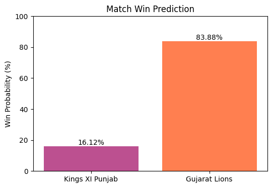

# IPL Match Win Probability Predictor

A Machine Learning project that predicts the probability of a team winning an IPL match during the second innings based on the current match situation.

---

## Project Overview

This project applies Machine Learning to analyze historical IPL match data and estimate the win probability of the chasing team.  
The prediction is based on match conditions such as runs remaining, balls remaining, wickets left, and run rates.

The model is trained using historical IPL ball-by-ball data and predicts the probability of winning for both teams.

---

## Features

- Predicts match win probability based on current match situation
- Uses historical IPL ball-by-ball match data
- Implements Logistic Regression for classification
- Interactive user inputs for match parameters
- Visualization of prediction results using bar charts

---

## Tech Stack

- Python  
- Pandas  
- NumPy  
- Scikit-learn  
- Matplotlib  

---

## Machine Learning Model

Algorithm used :

Logistic Regression (Supervised Learning)

Model workflow:

1. Data preprocessing  
2. Feature engineering  
3. Train-test split  
4. Model training  
5. Win probability prediction  

Model Accuracy : **~81%**

---

## Input Parameters

The prediction model takes the following match situation inputs:

- Batting Team
- Bowling Team
- Runs Left
- Balls Left
- Wickets Left
- Current Run Rate
- Required Run Rate
- Match City

---

## Example Output

Example prediction :

```
Match Prediction
---------------------
Kings XI Punjab Win Probability : 16.12%
Gujarat Lions Win Probability : 83.88%
```

The system also displays a **bar chart visualization** of the predicted probabilities.

---

## Example Output

Below is an example prediction generated by the model.


